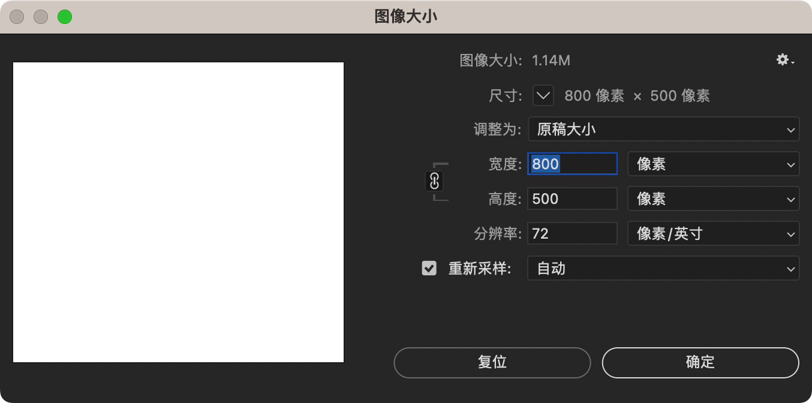

# 图像大小

在 Photoshop 中，调整图像大小是一项常见操作，尤其是在需要更改图像的分辨率或尺寸时。

以下是如何在 Mac 上调整图像大小的步骤：

## 调整步骤

1. **打开图像**：

   在 Photoshop 中根据上一节[“新建文档”](new-document.md)，或打开需要调整大小的图像。

2. **选择“图像大小”选项**：

   可以在顶部菜单中选择 `图像 > 图像大小...`，或使用快捷键 `Cmd + Option + I`。

3. **设置图像大小参数**：

    - **宽度和高度**：在“图像大小”对话框中，输入新的宽度和高度。可以选择不同的单位（如像素、英寸、厘米等）。
    - **链接图标（约束比例）**：确保“链接”图标是激活的，这样在调整宽度或高度时，另一个维度会按比例自动调整。如果不想保持图像的原始比例，可以点击链接图标将其解除。
    - **分辨率**：输入想要的分辨率（例如 72 ppi 用于屏幕显示，300 ppi 用于打印）。
    - **重采样**：如果想让 Photoshop 自动调整像素以适应新的尺寸，确保“重采样”选项是选中的。可以从下拉菜单中选择不同的重采样算法（例如“自动”、“双三次法（更清晰）”、“双三次法（更平滑）”等）。

4. **预览和确认**：

    - 在对话框中，可以预览调整后的图像大小。
    - 确认设置后，点击 `确定` 按钮，图像大小将被调整。

## 注意事项

- **保持分辨率**：如果不想改变图像的细节或质量，建议在调整图像尺寸时保持原始分辨率不变。
- **保持比例**：通常建议保持图像的原始比例，以避免图像失真。

## 使用场景

- **缩小图像用于 Web**：将图像尺寸调整为更小的像素数和分辨率，以适应网页布局并减少文件大小。
- **打印准备**：在打印之前调整图像为高分辨率（通常为 300 ppi），并设置合适的尺寸以确保打印质量。

通过这些步骤，可以轻松调整 Photoshop 中图像的大小，以满足不同的需求。