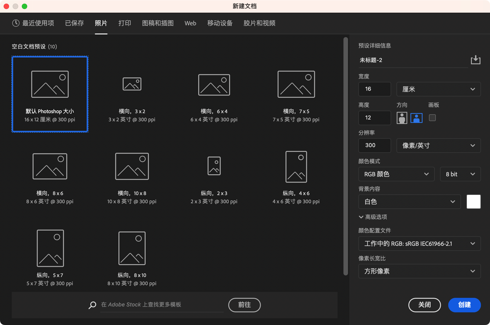
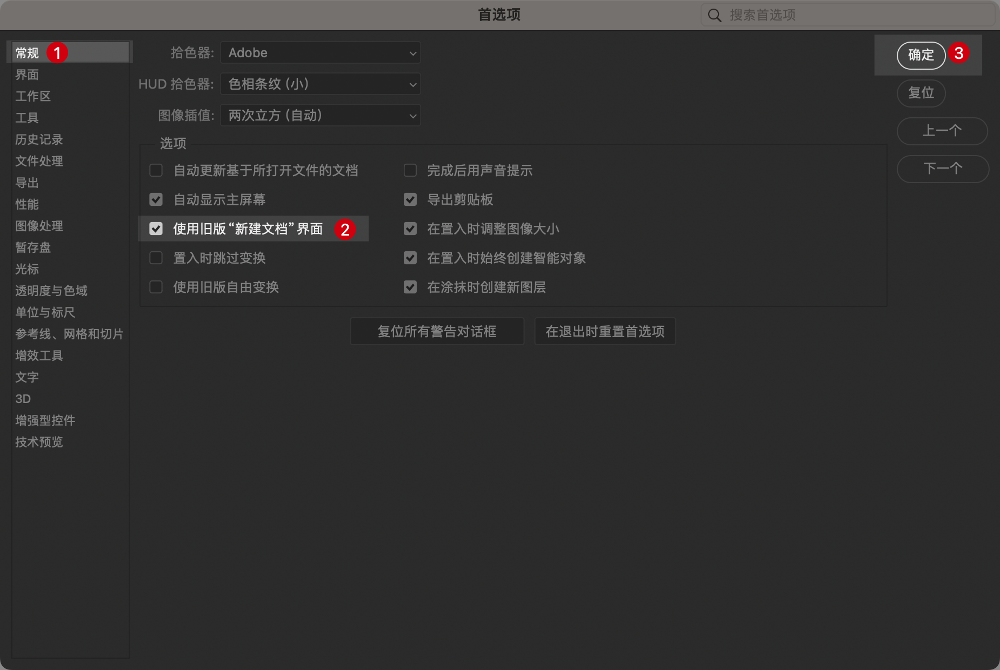
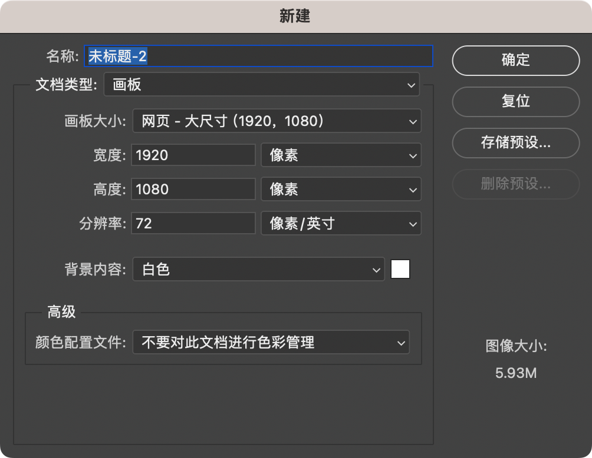

# 新建文档

以下是关于如何在 Mac 上新建 Photoshop 文档的步骤：

## 步骤

1. **新建文档**

   在顶部菜单中选择 `文件 > 新建...`，或使用快捷键 `Cmd + N`。

   ::: details 点击查看新建文档选项
   

   以上是新版文档选项，如果需要旧版文档，可以使用 “CMD + K” 打开 “首选项”后选择 “常规” -> 勾选“使用旧版‘新建文档’选项”并保存。

   

   如果选择使用旧版“新建文档”选项的话，再次打开新建文档选项可以看到这样的界面。

   
   :::

2. **设置文档参数**

    - **名称**：在“名称”字段中为文档命名。
    - **宽度和高度**：设置文档的尺寸，可以选择单位（如像素、英寸、厘米等）。
    - **分辨率**：通常使用 72 ppi（用于屏幕显示）或 300 ppi（用于打印）。
    - **颜色模式**：选择颜色模式（例如 RGB 颜色用于屏幕显示，CMYK 颜色用于打印）。
    - **背景内容**：选择文档背景（如白色、背景色、透明）。

3. **高级选项（可选）**

    - **色彩配置文件**：选择一个色彩配置文件，如 `sRGB IEC61966-2.1`（默认）或其他配置文件。
    - **像素长宽比**：通常为 `方形像素`，适用于大多数项目。

4. **创建文档**

   设置完毕后，点击 `创建` 按钮，文档将会在 Photoshop 的工作区中打开。

通过这些步骤，可以根据项目需求轻松创建适合的 Photoshop 文档。

## 文档预设

- **照片**：设置官渡和高度为英寸，颜色模式选择 RGB，分辨率为 300 ppi。
- **打印**：设置宽度和高度为英寸或厘米，颜色模式选择 CMYK，分辨率 300 ppi。
- **图稿和插画**：设置宽度和高度为像素或英寸，颜色模式选择 RGB，分辨率 300 ppi。
- **Web**：设置宽度和高度为像素，颜色模式选择 RGB，分辨率 72 ppi。
- **移动设备**：设置宽度和高度为像素，颜色模式选择 RGB，分辨率 72 ppi。
- **胶片和视频**：设置宽度和高度为像素，颜色模式选择 RGB，分辨率 72 ppi。

